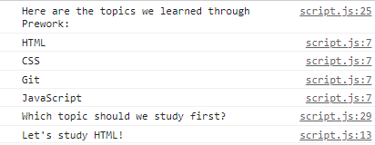

# Prework Study Guide Webpage

## Description

This Study Guide was created for boot camp students going through Prework to help prepare them for the course. It contains notes on HTML, CSS, Git, and JavaScript.

## Installation

N/A

## Usage

To use this Study Guide, you can review the notes in each section. For suggestions on what to study first, open the Chrome DevTools by pressing Command+Option+I (MacOS) or Control+Shift+I (Windows OS). A console panel should open either below or to the side of the webpage in the browser. There you will see a list of topics we learned from Prework along with a suggestion which topic to study first (see image below). 

## Credits

N/A

## License

Please refer to the LICENSE in the repo.
